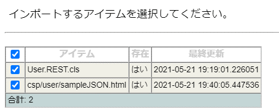
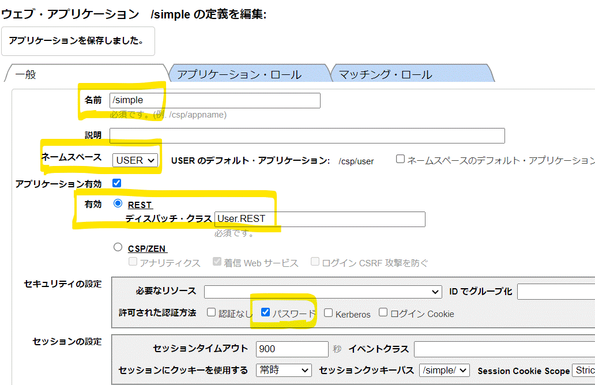

# InterSystems 製品で REST の操作をするシンプルなサンプル

REST クライアント、HTML、ターミナルからデータ（JSON）を送信し、サーバ（InterSystems製品）で JSON 形式のデータを返す REST を使った簡単なサンプルをご紹介します。

## サンプルの利用手順

- [(1) サンプルファイル（XML）のインポート](#1-サンプルファイルXMLのインポート)
    
    RESTディスパッチクラスとサンプルHTMLファイルが含まれています

- [(2) ウェブアプリケーションパスの設定](#2-ウェブアプリケーションパスの設定)
- [(3) 実行](#3-実行)


### (1) サンプルファイル（XML）のインポート

管理ポータルからインポートします（スタジオを利用されている場合は、スタジオでもインポートできます）。

管理ポータルは [http://localhost:52773/csp/sys/UtilHome.csp](http://localhost:52773/csp/sys/UtilHome.csp) でアクセスできます。

**※ ポート番号はお使いの環境に合わせて変更してください。**

管理ポータルにアクセスできたら以下メニューでインポートを行ってください。

**システムエクスプローラ > クラス > ネームスペース選択 > インポートボタンクリック > [サンプルファイル](./User.REST.xml)を選択してインポート**

メモ：インポートファイルを選択すると、インポートアイテムが表示されます（下図）。



クラス定義（User.REST）とHTMLファイル（sampleJSON.html）がインポートされます。


### (2) ウェブアプリケーションパスの設定

(1) でインポートしたクラス定義（User.REST）を REST ディスパッチクラスに指定したウェブアプリケーションパスを定義します。

管理ポータルを開き、以下メニューにアクセスします。

システム管理 > セキュリティ > ウェブ・アプリケーション > 「新しいウェブ・アプリケーションの作成」をクリックし、以下の図の設定を行ってください。

（サンプルでは、/simple を REST のベースパスとしています）



- ネームスペースはサンプルをインポートしたネームスペースを指定してください。
- ディスパッチクラス名には、 (1)でインポートした User.REST を指定します。大文字小文字を区別します。記入時ご注意ください。
- 「許可された認証方法」は、「パスワード」を設定します。アクセス時、ユーザ名とパスワードの入力欄が出てきたらユーザ名：_system、パスワードは SYS（または設定したパスワード）を記入してログインします。

> メモ：管理ポータルアクセス時にユーザ名、パスワードの入力欄が出ないアクセス（認証なしアクセス）では、デフォルト設定としてユーザ：_system に対するパスワードが **SYS**（大文字）で設定されています。サンプルテスト時ご利用ください。


### (3) 実行

(2) で作成したRESTディスパッチクラスを起動するためのベースパス（/simple）を利用してテストできます。

REST ディスパッチクラスには UrlMap という定義があり、ベースパスのあとに指定したパスに合わせて、どのメソッドが実行されるか定義されています。

```
XData UrlMap [ XMLNamespace = "http://www.intersystems.com/urlmap" ]
{
<Routes>
<Route Url="/req1" Method="GET" Call="req1"/>
<Route Url="/req2" Method="GET" Call="req2"/>
</Routes>
}
```

/simple/req1 を指定すると、以下のメソッドが実行されます。

```
ClassMethod req1() As %Status
{
	#dim %response As %CSP.Response
	set name1=%request.Get("NAME1")
	set name2=%request.Get("NAME2")
	set age=%request.Get("AGE")

	set %response.ContentType="application/json"
	set %response.CharSet="utf8"
	set tdobject = {}
	set tdobject.name=name1_" "_name2
	set tdobject.age=age
	write tdobject.%ToJSON()
	    
    quit $$$OK
}
```

以下 URL を利用して、/simple/req1 のテストが行えます（クエリ文字列に指定した内容が JSON として返送されます）。

[http://localhost:52773/simple/req1?NAME1=Yamada&NAME2=Taro&AGE=20](http://localhost:52773/simple/req1?NAME1=Yamada&NAME2=Taro&AGE=20)

**※ ポート番号はお使いの環境に合わせて変更してください。**

```
{"name":"Yamada Taro","age":"20"}
```

サンプル HTML [http://localhost:52773/csp/user/sampleJSON.html]([http://localhost:52773/csp/user/sampleJSON.html) を利用してテストする場合は、Pushボタンをクリックすると、HTMLファイル内で設定したクエリ文字列を GET 要求で送信し、RESTディスパッチクラスで加工した文字列が JSON として返送されます（ポップアップで表示されます）。 

以下、Pushボタン押下時の JavaScript です。
```
function go() {
  var url="/simple/req1";
  var params = {"NAME1" : "山田", "NAME2":"太郎","AGE":20};
  var queryparams= new URLSearchParams(params);
  url=url+"?"+ queryparams
  	fetch(url,{
	  headers:{"Accept":"application/json"},
	}
  	).then(function(Response) {
          console.log("status=" + Response.status);
          return Response.json();
      }).then(function(json) {
        alert("取得結果=" +JSON.stringify(json));
      });
 }
```

ポップアップに表示されるJSONは以下の通りです。

```
取得結果={"name":"山田 太郎","age":"20"}
```

ターミナルで実行する場合は以下のように [%Net.HttpRequest クラス](https://docs.intersystems.com/irislatestj/csp/docbook/Doc.View.cls?KEY=GNET_http)を利用します。

```
set req=##class(%Net.HttpRequest).%New()
set req.Server="localhost"
set req.Port=52773  // ポート番号は環境に合わせて変更してください
set base64=$system.Encryption.Base64Encode("_system:SYS")
do req.SetHeader("Authorization","Basic "_base64)
do req.SetParam("NAME1", "Yamada")
do req.SetParam("NAME2", "Taro")
do req.SetParam("AGE", "20")
set sts=req.Get("/simple/req1")

set ans=req.HttpResponse.Data.Read()
write ans
```

